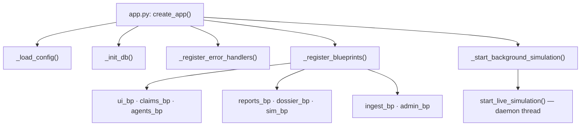
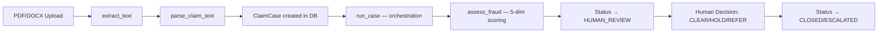

# ALSCSV12 — Project Summary & Deployment Audit

> **Project Name:** Sentinel / Allianz Anti-Fraud Command Studio  
> **Framework:** Flask 3.0.3 (Python)  
> **Database:** SQLite (local file `sentinel.db`)  
> **Deployment Target:** Azure App Service (Linux, Gunicorn)  
> **Port:** 7003 (dev) / `$PORT` (production via Gunicorn)

---

## 1. Project Directory Structure

```
ALSCSV12/
├── app.py                     # Main Flask entrypoint + app factory
├── requirements.txt           # Python dependencies
├── startup.txt                # Azure startup command: gunicorn --bind=0.0.0.0:$PORT --timeout 600 app:app
├── sentinel.db                # SQLite database (~2MB)
│
├── api/                       # REST API Blueprints (11 files)
│   ├── __init__.py            # Exports: claims_bp, agents_bp, reports_bp, ui_bp, checkpoints_bp, evidence_bp
│   ├── admin.py               # POST /api/admin/reset — demo session reset
│   ├── agents.py              # POST /api/agents/run/<id>, /run-batch — fraud pipeline execution
│   ├── claims.py              # GET/POST /api/claims — CRUD for claim cases
│   ├── checkpoints.py         # Checkpoint gate API
│   ├── decisions.py           # Decision recording
│   ├── dossier.py             # POST /api/dossier/parse — PDF upload + deterministic dossier parsing + TTL store
│   ├── evidence.py            # Evidence management
│   ├── reports.py             # POST /api/reports/decide/<id>, GET /api/reports/<id>, decision-pack
│   ├── sim.py                 # Simulation start/stop API
│   └── ui.py                  # GET /api/claims, /api/kpis, /api/audit/<id> — read-only UI support
│
├── agents/                    # Agent definitions (5 files — placeholder/stubs)
│   ├── coverage_agent.py
│   ├── decision_agent.py
│   ├── fraud_signal_agent.py
│   ├── intake_agent.py
│   └── learning_agent.py
│
├── ingest/                    # Document ingestion pipeline
│   ├── claim_parser.py        # Regex-based claim text parser → ParsedClaim dataclass
│   └── document_utils.py      # PDF/DOCX/TXT text extraction (pdfplumber + python-docx)
│
├── intelligence/              # Fraud scoring engine
│   ├── __init__.py            # Exports assess_fraud()
│   ├── fraud_engine.py        # 5-dimension fraud scorer (behavioural, historical, network, document, contextual)
│   ├── indicators.py          # Indicator definitions
│   └── thresholds.py          # Threshold config
│
├── models/                    # SQLAlchemy ORM
│   ├── __init__.py            # db = SQLAlchemy(), exports ClaimCase
│   └── claim_case.py          # ClaimCase model — 30+ columns across 5 domains
│
├── orchestration/             # Workflow engine
│   ├── audit_log.py           # JSONL audit log writer/reader
│   ├── runner.py              # run_case() pipeline: INTAKE → INVESTIGATING → HUMAN_REVIEW
│   └── state_machine.py       # CaseState enum + valid transitions enforcer
│
├── reports/                   # Generated report outputs
│   └── decision_pack.py       # Decision pack generator
│
├── simulation/                # Live demo data generation
│   ├── fraud_datagen.py       # Synthetic fraud case generator + live simulation loop
│   └── pdf_generator.py       # ReportLab-based PDF dossier generator
│
├── static/
│   ├── css/
│   │   ├── StlyeSBV2.css                  # Sidebar + global styles (12KB)
│   │   ├── baseCopilot.css                # Copilot widget styles
│   │   ├── styles.css                     # General styles
│   │   └── tender-response-studio.css     # TRS page styles (127KB)
│   ├── js/
│   │   ├── app.js                         # General app JS
│   │   ├── rcgcc-wiring.js                # RCGCC dashboard wiring (28KB)
│   │   ├── sentinel-api.js                # API client helper (5KB)
│   │   ├── tender-response-studio.js      # TRS main workflow JS (203KB)
│   │   ├── tender-response-studio2.js     # TRS supplementary JS
│   │   └── tenderstudio-wiring.js         # TRS wiring layer
│   ├── data/                              # Sample tender PDFs, JSONs, workflows
│   └── imgs/                              # Logos and images
│
├── templates/
│   ├── Manager/
│   │   ├── RCGCC.html                     # Main dashboard (89KB) — extends BaseLayout
│   │   ├── TenderResponseStudio.html      # Claim Investigation Studio (114KB) — standalone
│   │   └── demo.html                      # Demo page (44KB)
│   ├── layouts/
│   │   ├── BaseLayout.html                # Jinja2 base template (Bootstrap 5 + ECharts + AOS)
│   │   ├── DemoTopbar.html                # Top navigation bar
│   │   ├── WDLHeader.html                 # "Wow Demo Lab" branded header bar
│   │   └── sidebar.html                   # Collapsible icon sidebar navigation
│   └── partials/
│       └── copilot.html                   # AI copilot chat widget
│
├── data/                      # Sample data files (PDFs, DOCX, TXT)
├── uploads/                   # Runtime uploaded/generated PDFs
└── tests/
    └── conftest.py            # Pytest fixtures
```

---

## 2. Application Architecture

### 2.1 App Factory Pattern



### 2.2 Registered Blueprints (8 total)

| Blueprint   | Prefix              | Purpose                                    |
|-------------|---------------------|--------------------------------------------|
| `ui_bp`     | `/api`              | Read-only endpoints for RCGCC dashboard    |
| `claims_bp` | `/api/claims`       | CRUD for claim cases                       |
| `agents_bp` | `/api/agents`       | Run fraud pipeline on individual/batch cases |
| `reports_bp`| `/api/reports`      | Human decision recording + case reports    |
| `dossier_bp`| `/api/dossier`      | PDF upload → deterministic dossier parsing |
| `sim_bp`    | `/api/sim`          | Start/stop live simulation                 |
| `ingest_bp` | `/api/ingest`       | File upload + claim ingestion              |
| `admin_bp`  | `/api/admin`        | Demo session reset                         |

### 2.3 Data Flow Pipeline



### 2.4 Fraud Engine — 5 Dimensions

| Dimension     | Weight | Detects                                           |
|---------------|--------|---------------------------------------------------|
| Behavioural   | 25%    | Late reporting, repeat claims, clustering          |
| Historical    | 20%    | Prior fraud findings, similar loss patterns        |
| Network       | 25%    | Shared address/phone/bank, ring-fence indicators   |
| Document      | 15%    | Missing documents, inconsistencies                 |
| Contextual    | 15%    | Geographic anomalies, frequency deviations         |

**Scoring bands:** LOW (0–30), REVIEW (31–60), HIGH (61–100)

### 2.5 State Machine

```
INTAKE → INVESTIGATING → HUMAN_REVIEW → ESCALATED → CLOSED
                                       → CLOSED
```

### 2.6 ClaimCase Model (30+ columns)

Organized into 5 domains:
1. **Identity** — case_id, policy_id, claimant_id, claim_type, jurisdiction, loss_date
2. **Lifecycle** — status, current_stage, assigned_handler, SLA timestamps
3. **Intelligence** — fraud_score, fraud_band, fraud_confidence, triggered_indicators, reasoning
4. **Human Decision** — handler_decision, referred_unit, handler_notes, decision timestamps
5. **Audit** — created_at, updated_at, last_agent_run, schema_version

---

## 3. UI Layout

### 3.1 Page 1: RCGCC — "Allianz Anti-Fraud Command Studio" (`/`)

> Extends `BaseLayout.html` → includes WDLHeader + DemoTopbar + Sidebar

| Section | Description |
|---------|-------------|
| **Page Header** | Title "ALLIANZ ANTI-FRAUD COMMAND STUDIO" + Refresh button |
| **KPI Row** (left 8/12) | 4 animated KPI cards: Claims in Pipeline, Fast-Track Settlements, Fraud Confirmed, SLA Risk Claims |
| **Live Chart** (right 4/12) | ECharts multi-line time series — "Live Workstream Volume" |
| **Data Table** (left 9/12) | Paginated, sortable, filterable table of all claims — columns: Report Triggered, Data Confidence, Report Deadline, Review Stage, Event Type, Report Summary |
| **Agent Mesh Console** (right 3/12) | Real-time agentic narration panel with typed trace lines, progress bar, and narrated toggle |
| **Modal: Resolve & Respond** | Full orchestration workflow modal with 6 steps, CP1/CP2 governance gates, response drafting |
| **Modal: Case Summary PDF** | Generate governance pack PDF on demand |

**Design:** Dark-mode glassmorphism with navy/blue gradients, Inter font, animated KPI cards with ripple effects, colour-coded badge chips.

### 3.2 Page 2: TenderResponseStudio — "Claim Investigation Studio" (`/tender-response-studio`)

> Standalone page (own DOCTYPE), does **not** extend BaseLayout

| Section | Description |
|---------|-------------|
| **Header** | "Allianz Claim Shield" brand + "AI Orchestration Active" pill + Back button |
| **Upload Zone** | Drag-and-drop PDF/DOCX upload with validation, file preview, processing bar |
| **Fraud Assessment Console** | 6-step animated agent processing (parsing → entity extraction → network intel → fraud scoring → indicators → decision pack) |
| **Risk Dimension Grid** | 5 risk dimension bars (Behavioural, Historical, Network, Document, Contextual) with animated score fills |
| **Overall Score Ring** | SVG circular score ring with GO/CONDITIONAL GO/NO-GO badge |
| **Risk Flags** | Dynamic flag cards with severity levels, mitigation steps |
| **Workflow Board** | 6-agent workflow table: Agent name, Tasks, Tools Used |
| **Progress Timeline** | Horizontal pipeline progress indicator |
| **Completion Banner** | Success banner with Run Again, Agent Trace, Export buttons |
| **Modal: Investigation Report** | Full case report with 7 sections: Summary, Key Facts, Timeline, Fraud Assessment, Indicators table, Recommended Actions, Evidence Checklist |
| **Modal: Agent Trace Report** | Tabbed modal: Summary, Agent Execution (6 expandable cards), Human Gates (CP1/CP2), Version History, Performance |

**Design:** Light premium design, Inter + Sora fonts, gradients, micro-animations, SVG icons throughout. Print-optimized with `@media print` rules.

### 3.3 Shared Layout Components

- **BaseLayout.html** — Bootstrap 5.3.2, ECharts 5.5, AOS animations, jQuery 3.7.1
- **WDLHeader.html** — Fixed top bar with "Wow Demo Lab / Capgemini" branding + About modal
- **DemoTopbar.html** — Client topbar
- **sidebar.html** — DB-style collapsible sidebar with sections: Orchestration, Analysis & Drafting, Content & Governance, Assurance & Insights, Platform
- **copilot.html** — AI copilot chat widget partial

---

## 4. Background Simulation

The app starts a **daemon thread** on boot that generates synthetic fraud claims every 12 seconds:
- Cycles through 3 scenarios: `FRAUD_RING` (HIGH), `SUSPICIOUS_CLUSTER` (REVIEW), `CLEAR_FASTTRACK` (LOW)
- Each claim: create ClaimCase → run fraud pipeline → generate PDF dossier → extract text → commit
- This ensures the dashboard always has live, updating data for demos

---

## 5. Requirements.txt Audit for Azure Deployment

### Current `requirements.txt`

```
Werkzeug==3.0.3
flask==3.0.3
SQLAlchemy==2.0.30
Flask-SQLAlchemy==3.1.1
Flask-Session==0.8.0
Flask-Cors==4.0.1
pdfplumber==0.11.0
python-docx==1.1.2
reportlab==4.0.9
gunicorn==22.0.0
python-dotenv==1.0.1
pytest
```

### Audit Results

> [!IMPORTANT]
> **Line 1 has a formatting issue:** The line reads `# Core web framework# CoreFlask==3.0.3` — this is a malformed comment. `Flask==3.0.3` on that line will be **ignored** because the line starts with `#`. However, `flask==3.0.3` on line 3 will be picked up. This is not a blocker but should be cleaned up.

#### ✅ Packages Present & Correct

| Package | Version | Used By |
|---------|---------|---------|
| `flask` | 3.0.3 | Core web framework |
| `Werkzeug` | 3.0.3 | Flask dependency (pinned correctly) |
| `SQLAlchemy` | 2.0.30 | ORM |
| `Flask-SQLAlchemy` | 3.1.1 | Flask-SQLAlchemy integration |
| `Flask-Session` | 0.8.0 | Filesystem session backend |
| `Flask-Cors` | 4.0.1 | CORS headers |
| `pdfplumber` | 0.11.0 | PDF text extraction (`ingest/document_utils.py`) |
| `python-docx` | 1.1.2 | DOCX text extraction (`ingest/document_utils.py`) |
| `reportlab` | 4.0.9 | PDF generation (`simulation/pdf_generator.py`) |
| `gunicorn` | 22.0.0 | Production WSGI server |
| `python-dotenv` | 1.0.1 | `.env` loading |
| `pytest` | (latest) | Testing |

#### ⚠️ Issues & Missing Packages

| # | Issue | Severity | Detail |
|---|-------|----------|--------|
| 1 | **Line 1 malformed comment** | 🟡 Low | `# Core web framework# CoreFlask==3.0.3` — dead text. Clean up to just `# Core web framework` |
| 2 | **Duplicate Flask reference** | 🟡 Low | Line 1 has `Flask==3.0.3` (commented out), Line 3 has `flask==3.0.3`. Not harmful but confusing. |
| 3 | **`cachelib` not listed** | 🔴 **Blocker** | `Flask-Session==0.8.0` with `SESSION_TYPE='filesystem'` requires `cachelib`. Without it, sessions will crash at runtime. **Add `cachelib>=0.9.0`** |
| 4 | **`pytest` unpinned** | 🟡 Low | `pytest` has no version pin. For reproducibility, pin it (e.g., `pytest==8.2.0`) |
| 5 | **No `Jinja2` pin** | 🟢 Info | Pulled transitively by Flask but not pinned. Acceptable. |
| 6 | **`shutil` / stdlib modules** | 🟢 Info | Used in admin reset but part of Python stdlib — no pip install needed |

#### 📋 Recommended `requirements.txt` for Azure

```
# Core web framework
flask==3.0.3
Werkzeug==3.0.3

# DB / ORM
SQLAlchemy==2.0.30
Flask-SQLAlchemy==3.1.1

# Sessions (SESSION_TYPE='filesystem')
Flask-Session==0.8.0
cachelib>=0.9.0

# CORS
Flask-Cors==4.0.1

# PDF extraction (document_utils.py)
pdfplumber==0.11.0

# DOCX extraction (document_utils.py)
python-docx==1.1.2

# PDF generation (pdf_generator.py)
reportlab==4.0.9

# Production server (Linux)
gunicorn==22.0.0

# .env support
python-dotenv==1.0.1

# Testing
pytest==8.2.0
```

> [!WARNING]
> **Critical missing dependency:** `cachelib` is required by `Flask-Session` when using filesystem sessions. Without it, the app will crash on Azure with `ModuleNotFoundError: No module named 'cachelib'`. Add it before deployment.

---

## 6. Azure Deployment Checklist

| Item | Status | Notes |
|------|--------|-------|
| `startup.txt` present | ✅ | `gunicorn --bind=0.0.0.0:$PORT --timeout 600 app:app` |
| `app:app` exposed at module level | ✅ | `app = create_app('production')` at line 472 |
| `gunicorn` in requirements | ✅ | `gunicorn==22.0.0` |
| SQLite file-based DB | ⚠️ | Works but **ephemeral on Azure App Service** — DB resets on restart. Consider Azure PostgreSQL for persistence |
| `cachelib` dependency | ❌ | **Missing — must add** |
| `uploads/` directory | ⚠️ | Created at runtime, but files are ephemeral on Azure. Use Azure Blob Storage for production |
| `audit_log.jsonl` | ⚠️ | Written to local filesystem — ephemeral on Azure |
| Static files served by Flask | ✅ | Works with gunicorn, but consider Azure CDN for production |
| Background simulation thread | ⚠️ | Daemon thread works but only runs in one worker. Set `--workers 1` or use Azure WebJobs for production |

---

## 7. Key Observations

1. **Well-structured separation of concerns** — The fraud engine is pure computation (no DB/side effects), orchestration handles state transitions, and API blueprints are cleanly modular.

2. **Demo-grade system** — Uses synthetic data generation, keyword-based fraud signals, and deterministic scoring. No external AI/ML model calls.

3. **Heavy frontend** — The two main HTML templates (RCGCC: 89KB, TRS: 114KB) contain substantial inline CSS/JS. The TRS page alone has 203KB of JavaScript.

4. **Dual UI paradigm** — RCGCC uses Jinja2 template inheritance (BaseLayout → content block), while TRS is a standalone HTML document with its own complete structure.

5. **The `agents/` directory** contains 5 agent Python files (coverage, decision, fraud_signal, intake, learning) but these are **not imported or used anywhere** in the current codebase — they appear to be planned stubs.
